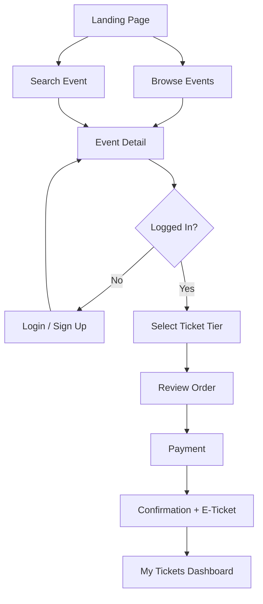

# PRD: E-ANTRE — Event Ticketing Platform

## 1. Product Summary

**E-ANTRE** adalah platform pembelian tiket event online yang memungkinkan pengguna menemukan, menjelajahi, dan membeli tiket untuk berbagai acara seperti konser, pertandingan olahraga, pertunjukan teater, dan festival.

Platform ini menyediakan pengalaman yang modern, cepat, dan aman — dari pencarian event hingga checkout tiket.

---

## 2. Target Audience

| Segmen | Deskripsi |
|--------|-----------|
| **Event-goers** | Pengguna yang ingin mencari dan membeli tiket event |
| **Event Organizers** | Pihak yang mempublikasikan dan mengelola event |
| **Admin** | Pengelola platform yang mengawasi konten dan transaksi |

---

## 3. Tech Stack

| Layer | Teknologi |
|-------|-----------|
| **Framework** | Next.js (App Router) |
| **Styling** | Tailwind CSS v4 |
| **Language** | TypeScript |
| **Database** | Supabase (PostgreSQL) |
| **Auth** | Supabase Auth |
| **Storage** | Supabase Storage (gambar event) |
| **Payment** | Midtrans / Xendit (opsional) |
| **Deployment** | Vercel |

---

## 4. Fitur Utama

### 4.1 Landing Page (Homepage)

Halaman utama yang menarik perhatian pengunjung baru.

| Komponen | Deskripsi |
|----------|-----------|
| **Navbar** | Logo, navigasi (Events, Venues, About, Support), Login/Sign Up |
| **Hero Section** | Background image, headline, search bar dengan location picker |
| **Categories** | Kartu kategori: Concerts, Sports, Theater, Festivals |
| **Upcoming Events** | Grid 4 event card populer + tombol "View All" |
| **Newsletter** | Section subscribe email untuk promo |
| **Footer** | Link navigasi, social media, copyright |

---

### 4.2 Browse Events Page

Halaman eksplorasi event dengan filter lengkap.

| Komponen | Deskripsi |
|----------|-----------|
| **Search Bar** | Global search di navbar |
| **Sidebar Filter** | Date picker, kategori (Concerts, Sports, Theater, Festivals), price range slider, location dropdown |
| **Event Grid** | Kartu event dengan gambar, tanggal, tag kategori, waktu, judul, lokasi, harga, tombol "Get Tickets" |
| **Sort** | Dropdown sort: Featured, Date, Price (Low-High), Price (High-Low) |
| **Pagination** | Navigasi halaman (1, 2, 3 ... 12) |

---

### 4.3 Event Detail Page

Halaman detail event individual.

| Komponen | Deskripsi |
|----------|-----------|
| **Hero Banner** | Full-width gambar event dengan judul, tanggal, lokasi, dan tag kategori |
| **About the Event** | Deskripsi lengkap event dalam bentuk teks |
| **Tickets Section** | Daftar tier tiket (General Admission, VIP, dll.) dengan harga, dan tombol "Buy Tickets Now" |
| **Artist/Performer Lineup** | Grid card artis/performer dengan foto dan nama |
| **Venue Location** | Nama venue, peta lokasi (embed map), tombol "Open in Google Maps" |

---

### 4.4 Authentication

| Fitur | Deskripsi |
|-------|-----------|
| **Sign Up** | Registrasi dengan email & password |
| **Log In** | Login dengan email & password |
| **OAuth** | Login via Google (opsional) |
| **Protected Routes** | Halaman checkout dan profil memerlukan login |

---

### 4.5 Checkout & Pembelian Tiket

| Fitur | Deskripsi |
|-------|-----------|
| **Pilih Tiket** | User memilih tier dan jumlah tiket |
| **Review Order** | Ringkasan pesanan sebelum bayar |
| **Payment** | Integrasi payment gateway |
| **Konfirmasi** | Halaman konfirmasi + e-ticket (PDF/QR Code) |

---

### 4.6 User Dashboard

| Fitur | Deskripsi |
|-------|-----------|
| **My Tickets** | Daftar tiket yang sudah dibeli |
| **Profile** | Edit profil user |
| **Order History** | Riwayat transaksi |

---

### 4.7 Admin Dashboard *(Opsional / Phase 2)*

| Fitur | Deskripsi |
|-------|-----------|
| **Manage Events** | CRUD event (Create, Read, Update, Delete) |
| **Manage Users** | Lihat dan kelola user |
| **Sales Report** | Statistik penjualan tiket |

---

## 5. Database Schema

### Events

| Column | Type | Description |
|--------|------|-------------|
| `id` | UUID | Primary key |
| `title` | text | Nama event |
| `slug` | text | URL-friendly identifier |
| `description` | text | Deskripsi event |
| `category` | enum | concerts, sports, theater, festivals |
| `image_url` | text | URL gambar event |
| `venue_name` | text | Nama venue |
| `venue_address` | text | Alamat venue |
| `latitude` | float | Koordinat venue |
| `longitude` | float | Koordinat venue |
| `event_date` | timestamp | Tanggal & waktu event |
| `created_at` | timestamp | Waktu data dibuat |

### Ticket Tiers

| Column | Type | Description |
|--------|------|-------------|
| `id` | UUID | Primary key |
| `event_id` | UUID | Foreign key → Events |
| `name` | text | Nama tier (General, VIP, dll.) |
| `description` | text | Deskripsi tier |
| `price` | decimal | Harga tiket |
| `quota` | integer | Jumlah tiket tersedia |
| `sold` | integer | Jumlah tiket terjual |

### Users

| Column | Type | Description |
|--------|------|-------------|
| `id` | UUID | Primary key (Supabase Auth) |
| `full_name` | text | Nama lengkap |
| `email` | text | Email |
| `avatar_url` | text | Foto profil |
| `created_at` | timestamp | Waktu registrasi |

### Orders

| Column | Type | Description |
|--------|------|-------------|
| `id` | UUID | Primary key |
| `user_id` | UUID | Foreign key → Users |
| `event_id` | UUID | Foreign key → Events |
| `ticket_tier_id` | UUID | Foreign key → Ticket Tiers |
| `quantity` | integer | Jumlah tiket |
| `total_price` | decimal | Total harga |
| `status` | enum | pending, paid, cancelled, refunded |
| `created_at` | timestamp | Waktu order |

### Performers

| Column | Type | Description |
|--------|------|-------------|
| `id` | UUID | Primary key |
| `event_id` | UUID | Foreign key → Events |
| `name` | text | Nama performer |
| `image_url` | text | Foto performer |
| `role` | text | Headliner, Guest, dll. |
| `perform_date` | text | Tanggal tampil (opsional) |

---

## 6. User Flow

---

## 7. Pages & Routes

| Route | Page | Auth |
|-------|------|------|
| `/` | Landing Page | ❌ |
| `/events` | Browse Events | ❌ |
| `/events/[slug]` | Event Detail | ❌ |
| `/events/[slug]/checkout` | Checkout | ✅ |
| `/login` | Login | ❌ |
| `/register` | Sign Up | ❌ |
| `/dashboard` | User Dashboard | ✅ |
| `/dashboard/tickets` | My Tickets | ✅ |
| `/dashboard/profile` | Profile | ✅ |
| `/admin` | Admin Dashboard | ✅ (Admin) |

---

## 8. Non-Functional Requirements

| Aspek | Target |
|-------|--------|
| **Performance** | First Contentful Paint < 1.5s |
| **Responsive** | Mobile-first, support semua ukuran layar |
| **SEO** | Meta tags, Open Graph, sitemap |
| **Accessibility** | Semantic HTML, keyboard navigation |
| **Security** | HTTPS, input validation, auth middleware |
| **Image Optimization** | Next.js Image component, WebP format |

---

## 9. Development Phases

### Phase 1 — Foundation *(Minggu 1-2)*
- [x] Setup project Next.js + Tailwind CSS
- [x] Landing Page (Navbar, Hero, Categories, Events, Newsletter, Footer)
- [ ] Setup Supabase (database + auth)
- [ ] Halaman Login & Register
- [ ] Browse Events Page (dengan filter & pagination)

### Phase 2 — Core Features *(Minggu 3-4)*
- [ ] Event Detail Page
- [ ] Sistem pembelian tiket (checkout flow)
- [ ] User Dashboard (My Tickets, Profile)
- [ ] Integrasi Payment Gateway

### Phase 3 — Polish & Extras *(Minggu 5-6)*
- [ ] E-Ticket (PDF/QR Code generation)
- [ ] Admin Dashboard
- [ ] Newsletter email integration
- [ ] Performance optimization & testing
- [ ] Deployment ke Vercel
